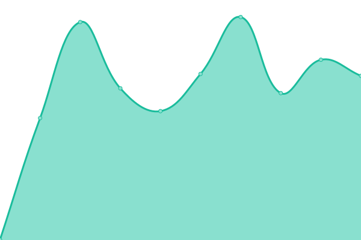

# [📈 Live Status](https://Sasillo.github.io/upptime): <!--live status--> **🟧 Partial outage**

This repository contains the open-source uptime monitor and status page for [VirtualBoy](https://Sasillo.github.io/upptime), powered by [Upptime](https://github.com/upptime/upptime).

With [Upptime](https://upptime.js.org), you can get your own unlimited and free uptime monitor and status page, powered entirely by a GitHub repository. We use [Issues](https://github.com/Sasillo/upptime/issues) as incident reports, [Actions](https://github.com/Sasillo/upptime/actions) as uptime monitors, and [Pages](https://Sasillo.github.io/upptime) for the status page.

<!--start: status pages-->
<!-- This summary is generated by Upptime (https://github.com/upptime/upptime) -->
<!-- Do not edit this manually, your changes will be overwritten -->
<!-- prettier-ignore -->
| URL | Status | History | Response Time | Uptime |
| --- | ------ | ------- | ------------- | ------ |
|  [Mail](https://mail.selgaraje.com) | 🟩 Up | [mail.yml](https://github.com/Sasillo/upptime/commits/HEAD/history/mail.yml) | 

 1078ms
     
 | 

<a href="https://Sasillo.github.io/upptime/history/mail">97.03%</a>
    

|  [Mail SMTP](mail.selgaraje.com) | 🟩 Up | [mail-smtp.yml](https://github.com/Sasillo/upptime/commits/HEAD/history/mail-smtp.yml) | 

 151ms
     
 | 

<a href="https://Sasillo.github.io/upptime/history/mail-smtp">97.04%</a>
    

|  [Mail SMTPs](mail.selgaraje.com) | 🟩 Up | [mail-smt-ps.yml](https://github.com/Sasillo/upptime/commits/HEAD/history/mail-smt-ps.yml) | 

 151ms
     
 | 

<a href="https://Sasillo.github.io/upptime/history/mail-smt-ps">97.06%</a>
    

|  [Mail Submission](mail.selgaraje.com) | 🟩 Up | [mail-submission.yml](https://github.com/Sasillo/upptime/commits/HEAD/history/mail-submission.yml) | 

 151ms
     
 | 

<a href="https://Sasillo.github.io/upptime/history/mail-submission">97.07%</a>
    

|  [Mail IMAPs](mail.selgaraje.com) | 🟩 Up | [mail-ima-ps.yml](https://github.com/Sasillo/upptime/commits/HEAD/history/mail-ima-ps.yml) | 

 152ms
     
 | 

<a href="https://Sasillo.github.io/upptime/history/mail-ima-ps">97.08%</a>
    

|  [Cloud](https://cloud.selgaraje.com) | 🟥 Down | [cloud.yml](https://github.com/Sasillo/upptime/commits/HEAD/history/cloud.yml) | 

 0ms
     
 | 

<a href="https://Sasillo.github.io/upptime/history/cloud">0.00%</a>
    

|  [Secure](https://secure.selgaraje.com) | 🟩 Up | [secure.yml](https://github.com/Sasillo/upptime/commits/HEAD/history/secure.yml) | 

 812ms
     
 | 

<a href="https://Sasillo.github.io/upptime/history/secure">97.09%</a>
    

|  [Media](https://media.selgaraje.com) | 🟥 Down | [media.yml](https://github.com/Sasillo/upptime/commits/HEAD/history/media.yml) | 

 698ms
     
 | 

<a href="https://Sasillo.github.io/upptime/history/media">100.00%</a>
    

|  [Media MS](media.selgaraje.com) | 🟥 Down | [media-ms.yml](https://github.com/Sasillo/upptime/commits/HEAD/history/media-ms.yml) | 

 0ms
     
 | 

<a href="https://Sasillo.github.io/upptime/history/media-ms">100.00%</a>
    

|  [News](https://news.selgaraje.com) | 🟩 Up | [news.yml](https://github.com/Sasillo/upptime/commits/HEAD/history/news.yml) | 

 881ms
     
 | 

<a href="https://Sasillo.github.io/upptime/history/news">97.10%</a>
    

|  [Cuélebre](https://cuelebre.selgaraje.com) | 🟩 Up | [cuelebre.yml](https://github.com/Sasillo/upptime/commits/HEAD/history/cuelebre.yml) | 

 729ms
     
 | 

<a href="https://Sasillo.github.io/upptime/history/cuelebre">97.10%</a>
    

|  [Belenos](https://belenos.selgaraje.com) | 🟩 Up | [belenos.yml](https://github.com/Sasillo/upptime/commits/HEAD/history/belenos.yml) | 

 760ms
     
 | 

<a href="https://Sasillo.github.io/upptime/history/belenos">97.11%</a>
    

<!--end: status pages-->

[**Visit our status website →**](https://Sasillo.github.io/upptime)

## 📄 License

- Powered by: [Upptime](https://github.com/upptime/upptime)
- Code: [MIT](./LICENSE) © [VirtualBoy](https://Sasillo.github.io/upptime)
- Data in the `./history` directory: [Open Database License](https://opendatacommons.org/licenses/odbl/1-0/)
